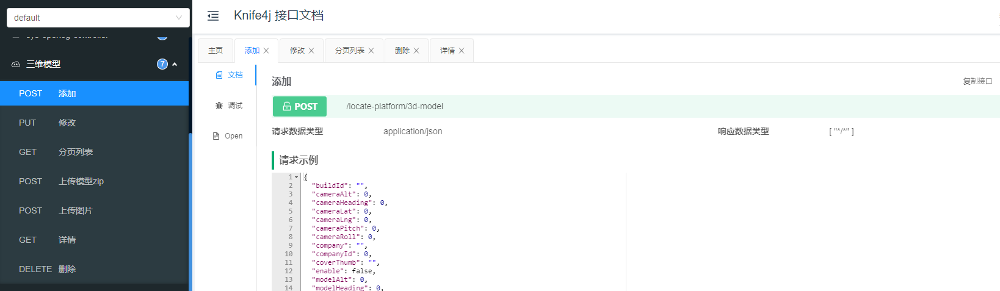
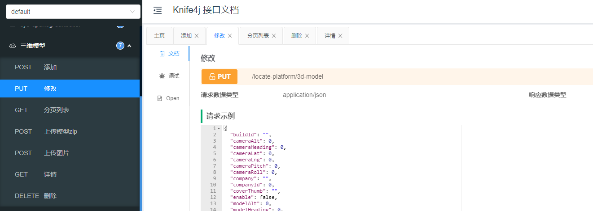
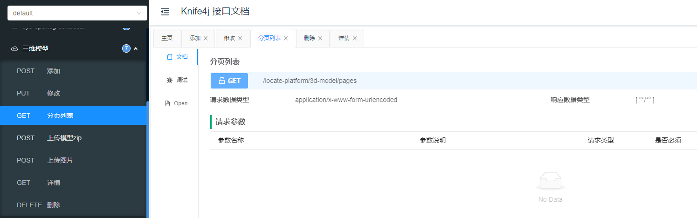
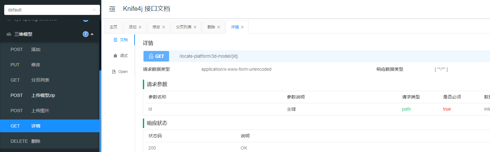
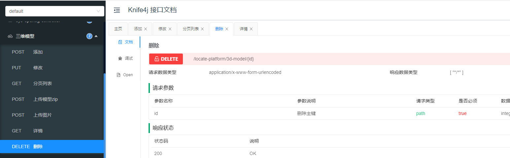
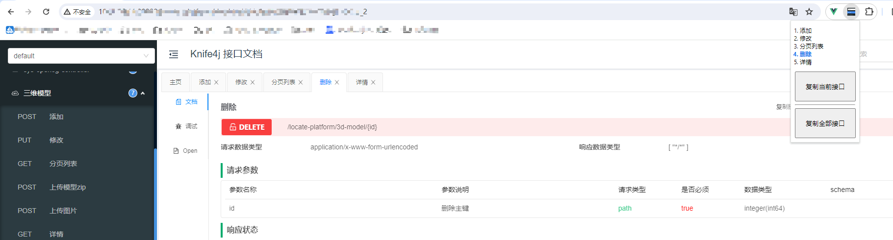
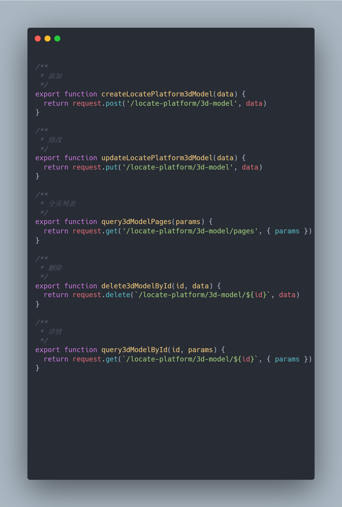

# knife4j2js
Chrome扩展程序, 可根据 knife4j 文档生成前端接口js代码.  
## 访问数 


## 安装使用
1. 打开扩展程序页面 -> 开启开发者模式 -> 加载已解压的扩展程序
2. 打开knife4j文档页面, 查看想要的接口信息,可在插件图标上选择 **复制当前接口** 或者 **复制打开的所有接口**


## 功能
1. 自动生成注释, 取自文档中的接口标题
2. 自动生成驼峰式函数名(根据请求方式和接口路径生成), 添加参数
3. 对含有路径参数的URL做处理: 例如 ` GET /platform/3d-model/{id}` 会生成 
    ```javascript
    /**
     * 详情
     */
    export function query3dModelById(id, params) {
      return request.get(`/locate-platform/3d-model/${id}`, { params })
    }
    
    ```
4. 复制到剪切板

### 使用示例
### 例如查看了如下5个接口:








### 右上角选择`复制全部接口`, 复制后得到的结果:



